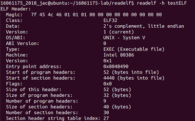
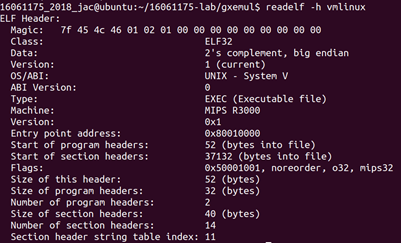
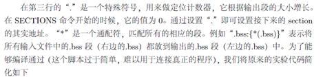
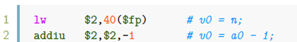

# 一、实验思考题

## Thinking 1.1 

> 也许你会发现我们的readelf 程序是不能解析之前生成的内核文件(内核文件是可执行文件) 的，而我们之后将要介绍的工具readelf 则可以解析，这是为什么呢？(提示：尝试使用readelf -h，观察不同)

我们分别用系统自带的readelf工具分析testELF文件和vmlinux文件的ELF Header信息，结果如下：

由上图可以看出，testELF文件数据为小端存储，vmlinux文件数据为大端存储，原因在于二者的CPU平台不同，PowerPC，MIPS等架构采用big endian方式存储数据，而Intel x86系列则采用little endian方式存储数据。我们的程序只能解析小端存储的文件，所以不能解析之前生成的内核文件。

# 二、实验难点

# 三、体会与感想

# 四、指导书反馈

（1）    在指导书第49页中，

“其实地址”应该改为“起始地址”。

（2）在第53页中，

第二行代码的注释有误，应该改为v0=v0-1或者v0=n-1。

 